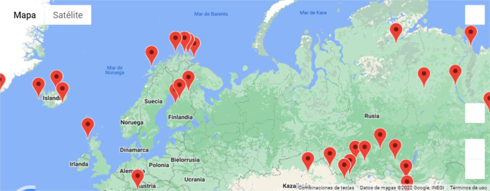
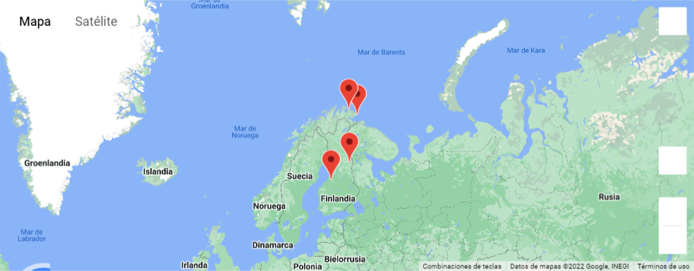
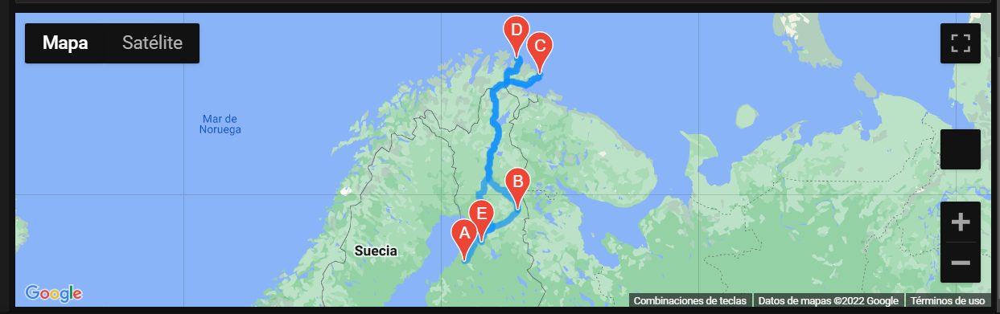

# World_Weather_Analysis

## Overview
The following project was to create a tourism service through the internet. 
Using API calls the following project is able to provide an itinerary for tourist with routes and hotel names for trips around the globe using various parameters like weather and available route and hotels to create a travel plan. 

## Resources 
Tools and languages: Pandas, Jupyter Notebook, Numpy, API calls (Open Weather Map API, Google Places API, Google DIrections API). Citipy. 

## Results
[table1](Vacation_Database/WeatherPy_Database.csv) 
- The following table was created enlisting random cities using lat. and long. random generator.

[table2](Vacation_Search/WeatherPy_vacation.csv)
- The following tablewas created extracting possible cities out of the first list using weather characteristics and aviable hotels for those places.

 
- The following map was obtained locating those available options. 

- A selected area of interest was selected and the proposed chosen cities where the following

 
- The following driving routes were obtained using API call services as a final route map. 

## Summary
Following project enables users to plan trips using API calls according to desired areas of interest, weather characteristics and portraying nearby available locations for driving walking or biking routes as well as nearby hotels.
